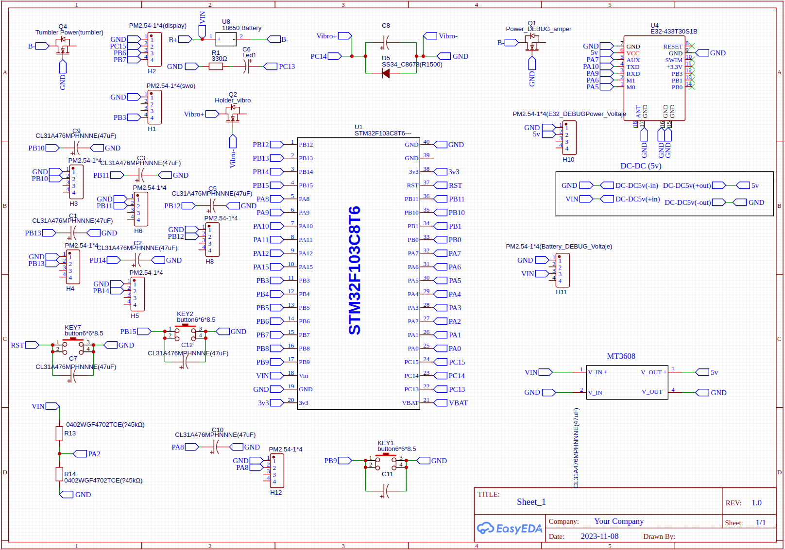

# STM32-based Small Data Packet Transmission Project

Software part for a long-range packet transmission device, developed for the STM32F103C8T6 microcontroller. The communication module used is the LoRa module Ebyte E32-433T30.

## Project Structure

The project is built using the CubeIDE development environment and follows the standard structure for projects created in this environment.

## Environment Requirements

The project can be compiled using the built-in CubeIDE compiler.

## Installation Instructions

1. Clone the repository to your local machine.
2. Open the project in the CubeIDE environment by specifying the project folder, or download the project archive and open it in CubeIDE.

## Running Instructions

Upload the firmware to the device assembled according to the transmitter schematic.

## Usage Example

The project implements information transmission using LoRa technology at a frequency of 433 MHz, utilizing the power-saving Standby mode.

## Configuration

The fsm.h file provides the option for manual configuration adjustment by modifying #define lines.

## Code Examples

The project is built based on a finite-state machine. The fsm.h file presents a structure for managing transitions in the finite-state machine.

```c
typedef struct tag_point {
    NumberStateInterrupt interruptBeginState;
    NumberStateInterrupt interruptEndState;
    void (*out)(void);
    uint32_t (*in)(void);
    void (*time)(void);
    uint32_t next[NUMBER_STATE];
} tag_point;

```
Project schema

## Contribution
If you have suggestions or remarks, please send them to arruin1996@gmail.com.

## Contacts
You can reach us via email at arruin1996@gmail.com. We are open to feedback and happy to address your inquiries.

Feel free to let me know if you need any additional changes or additions.


  
